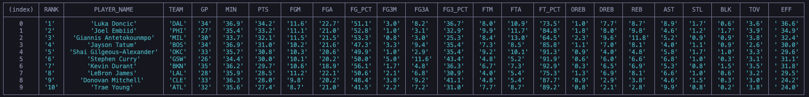

# NBA Leaders Board

This Node application is designed to scrape the top 10 players and their stats from NBA.com.  It uses the Puppeteer library to launch a headless browser, scrape the data, and then format it into a useable array of objects.

## Technologies

This is a [Node](https://nodejs.org/en/) application that uses the [Puppeteer](https://pptr.dev/) library.

## Installation

1. Git clone the repository, then run `npm i` to download dependancies

2. The app can be launched from the terminal with `node app`

## Author

I am a self-employed developer in the Washington D.C. area.  Please reach out if you'd like to collaborate on something!